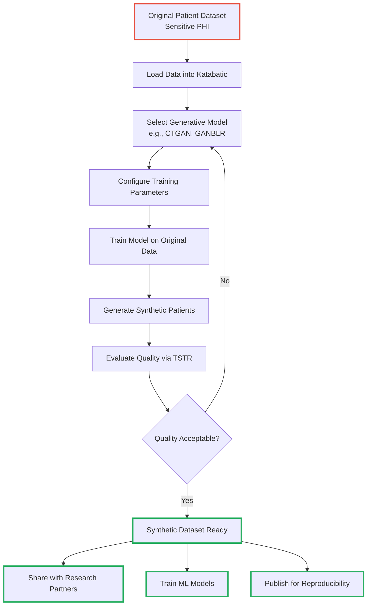
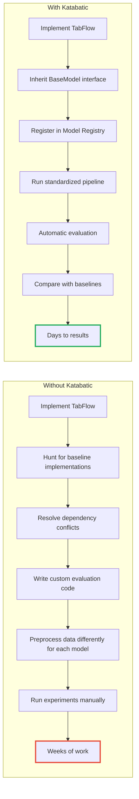
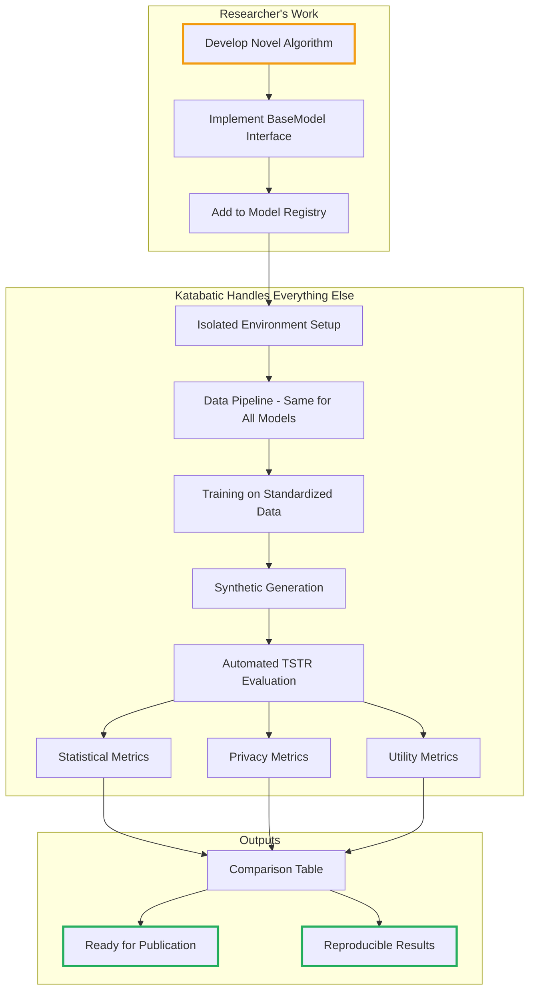
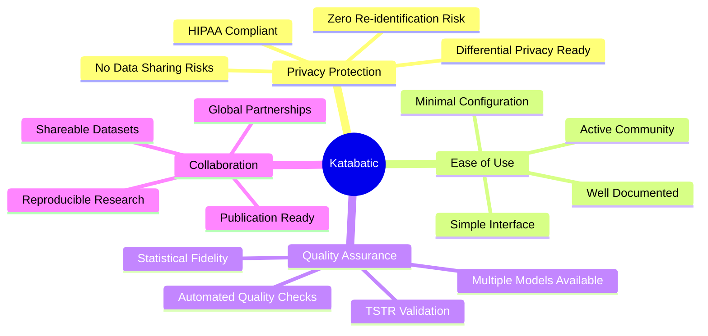
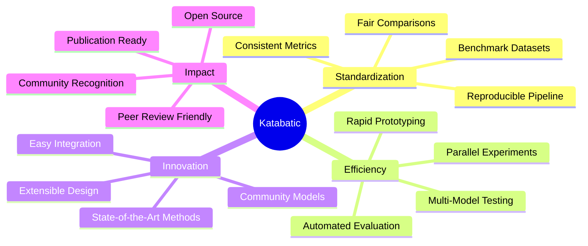

# Katabatic Use Cases: Example Applications

## Introduction

Katabatic is a powerful framework designed to streamline synthetic tabular data generation for researchers, data scientists, and industry professionals. This document showcases potential real-world applications through two example persona-based use cases that illustrate how different users could benefit from the framework.

---

## Example Persona 1: Medical Researcher

### Profile

**Role:** Medical Researcher
**Organization:** Hospital Research Division
**Challenge:** Need to share patient data for collaborative research while maintaining strict privacy compliance (HIPAA)

### The Problem

A medical researcher has a dataset containing sensitive patient health information (PHI) with the following attributes:

- **Demographics**: Patient age, gender, ethnicity
- **Medical History**: Diagnoses, medications, pre-existing conditions
- **Lab Results**: Blood work, vital signs, test outcomes
- **Treatment Outcomes**: Response to treatments, recovery rates

The researcher wants to:

1. Train machine learning models to predict treatment outcomes
2. Share data with research partners at other institutions
3. Publish findings with reproducible datasets
4. **Cannot** share original data due to privacy regulations

### The Challenge

Medical data is incredibly valuable for research, but strict privacy laws like HIPAA prevent researchers from sharing real patient records. Traditional anonymization techniques like removing names and IDs are insufficient—modern re-identification attacks can still compromise patient privacy. A solution is needed that allows collaboration and advances medical science without putting patients at risk.

### How Katabatic Could Help

Katabatic enables researchers to generate **privacy-safe synthetic patient data** that maintains the statistical properties and relationships of the original dataset while completely protecting individual patient privacy. The synthetic data looks and behaves like real patient data but contains no actual patient information.

### The Workflow

### Step-by-Step Process

**Step 1: Load Your Data**
The researcher loads their sensitive patient dataset into Katabatic. The data never leaves their secure environment.

**Step 2: Choose a Model**
Katabatic offers multiple state-of-the-art generative models. The researcher could select CTGAN, a model specifically designed for tabular data that preserves complex correlations.

**Step 3: Configure Settings**
They set parameters like how many epochs to train and batch sizes. Katabatic provides sensible defaults, so minimal configuration is needed.

**Step 4: Train the Model**
The generative model learns the patterns, distributions, and relationships in the original patient data without memorizing individual patients.

**Step 5: Generate Synthetic Data**
Once trained, the model generates entirely new synthetic patient records that have never existed but have the same statistical properties as the real data.

**Step 6: Validate Quality**
Katabatic automatically evaluates the synthetic data using TSTR (Train on Synthetic, Test on Real) methodology. This ensures the synthetic data is high-quality and useful for downstream tasks.

**Step 7: Use Freely**
With validated synthetic data, the researcher can now share it freely with collaborators, publish it with their research, and use it for model training—all without privacy concerns.

### Potential Benefits

**Privacy & Compliance**

- ✅ No real patient data leaves the institution
- ✅ Full HIPAA compliance maintained
- ✅ Zero risk of patient re-identification

**Data Quality**

- ✅ Preserves correlations, distributions, and relationships
- ✅ Statistical fidelity validated through TSTR metrics
- ✅ Realistic synthetic data for ML model training

**Collaboration & Research**

- ✅ Share datasets freely without lengthy IRB approvals
- ✅ Other researchers can validate findings using the same synthetic data
- ✅ Reproducible research with standardized evaluation

### Expected Impact

**Data Generation**

- Generation of large synthetic patient datasets
- Complete privacy protection with zero risk of patient identification

**Collaboration & Sharing**

- Sharing data across multiple research institutions
- Publishing studies with publicly available synthetic datasets
- Accelerated collaborative research timelines

---

## Example Persona 2: Research Assistant

### Profile

**Role:** PhD Research Assistant
**Organization:** University AI Lab
**Challenge:** Developing a new generative model and needs a standardized framework for fair comparison with existing methods

### The Problem

A PhD research assistant is developing a novel generative model (let's call it **TabFlow**) that uses normalizing flows for tabular data generation. To demonstrate its effectiveness, they need to compare it against existing methods. However, they face significant challenges:

1. **No Standardized Evaluation**: Each existing model uses different metrics and benchmarks
2. **Dependency Conflicts**: Can't run CTGAN and TabDDPM in the same environment due to incompatible library versions
3. **Time-Consuming Setup**: Weeks could be spent just configuring baseline models for comparison
4. **Unfair Comparisons**: Different data preprocessing across implementations makes results incomparable
5. **Difficult to Reproduce**: No consistent pipeline means reviewers can't verify the results

### The Traditional Approach vs. Katabatic

### How Katabatic Could Help

Katabatic provides a **plug-and-play architecture** where the researcher can integrate their new model and immediately compare it against multiple state-of-the-art baseline models using identical data pipelines, preprocessing, and evaluation metrics. This ensures fair comparisons and reproducible results.

### The Workflow

### Step-by-Step Process

**Step 1: Develop Your Model**
The researcher implements their novel algorithm using their preferred approach (e.g., normalizing flows for tabular data).

**Step 2: Implement the Interface**
Katabatic provides a simple BaseModel interface. The researcher implements just two methods: `fit()` for training and `generate()` for creating synthetic data.

**Step 3: Register the Model**
The new model is added to Katabatic's model registry, making it available throughout the framework.

**Step 4: Run Benchmarks Automatically**
Katabatic's standardized pipeline automatically:

- Tests the new model against all baseline models (CTGAN, CWGAN, GANBLR, TabDDPM, etc.)
- Uses identical data preprocessing for fair comparisons
- Runs on multiple benchmark datasets (Adult, Car, Magic, Nursery, Shuttle)
- Handles dependency isolation so models don't conflict
- Computes standardized evaluation metrics (TSTR, privacy measures, utility scores)

**Step 5: Analyze Results**
Katabatic outputs comprehensive comparison tables showing how the new model performs against every baseline across all metrics and datasets.

**Step 6: Publish with Confidence**
The results are reproducible—anyone can run the same Katabatic pipeline and get the same results. Reviewers can verify the findings, and the research community can build on the work.

### Potential Benefits

**Development Efficiency**

- ✅ Rapid integration - add new models in minimal time
- ✅ No dependency conflicts through isolated environments
- ✅ Focus on innovation, not infrastructure

**Fair & Standardized Evaluation**

- ✅ Identical data preprocessing for all models
- ✅ TSTR, privacy, and utility metrics computed automatically
- ✅ Multi-dataset benchmarking across multiple datasets instantly

**Research Impact**

- ✅ Complete reproducibility - other researchers can replicate experiments exactly
- ✅ Publication-ready comparison tables and results
- ✅ Community contribution - share new models with others via Katabatic

### Expected Impact

**Efficiency Gains**

- Significantly reduced time from model development to benchmarking
- Easier peer review process with reproducible results

**Research Quality**

- Fair and transparent comparisons with existing methods
- Consistent evaluation across multiple datasets
- Fully reproducible research results

**Community Contribution**

- Contribution of new models back to the research community
- Shared knowledge and collaborative advancement

---

## Why Choose Katabatic?

### For Practitioners

**Katabatic could solve real-world problems** for practitioners who need to work with sensitive data. Whether in healthcare, finance, government, or any privacy-sensitive domain, Katabatic provides a potential path to generate and share synthetic data.

### For Researchers

**Katabatic aims to accelerate research** by providing the infrastructure needed for rigorous, reproducible synthetic data generation research. Focus on innovation, not implementation.

---

## Getting Started with Katabatic

### Installation

Getting started with Katabatic is straightforward. The framework is designed to be accessible to both practitioners and researchers.

**Installation Steps:**

1. Clone the Katabatic repository
2. Install dependencies using the provided requirements file
3. You're ready to generate synthetic data!

### For Practitioners

If you need to generate synthetic data from sensitive datasets:

**Setup & Configuration**

1. Load your data into Katabatic
2. Choose a model from the model registry (CTGAN, GANBLR, TabDDPM, etc.)
3. Train the model on your data

**Generation & Validation** 4. Generate synthetic samples that preserve your data's properties 5. Validate quality using automated TSTR evaluation

**Deployment** 6. Use your synthetic data freely for sharing, collaboration, and research

The process is streamlined and intuitive, with sensible defaults that work well for most use cases.

### For Researchers

If you're developing new generative models:

**Model Integration**

1. Implement the BaseModel interface with your novel algorithm
2. Register your model in the model registry

**Evaluation & Analysis** 3. Run standardized benchmarks against existing models 4. Analyze results using consistent metrics across datasets

**Publication & Contribution** 5. Publish with confidence knowing your results are reproducible 6. Contribute back to help the community

Katabatic handles all the infrastructure so you can focus on innovation.

---

## The Katabatic Advantage

### Comprehensive Model Support

Katabatic includes multiple state-of-the-art generative models:

**GAN-Based Models**

- **CTGAN** - Conditional Tabular GAN
- **CWGAN** - Conditional Wasserstein GAN
- **GANBLR** - GAN with Bayesian Learning Rules
- **MedGAN** - Medical data generation GAN
- **PATEGAN** - Private Aggregation of Teacher Ensembles GAN

**Transformer & Diffusion Models**

- **GReaT** - Generation of Realistic Tabular data
- **TabDDPM** - Tabular Denoising Diffusion Probabilistic Models
- **TabSyn** - Tabular Synthesis with advanced techniques

Each model is carefully integrated with consistent interfaces and isolated dependencies.

### Rigorous Evaluation

Katabatic doesn't just generate data—it ensures quality through comprehensive evaluation:

**Quality Validation**

- **TSTR (Train on Synthetic, Test on Real)** - The gold standard for evaluating synthetic data utility
- **Statistical Metrics** - Distribution comparisons, correlation preservation

**Privacy & Utility Assessment**

- **Privacy Metrics** - Measuring re-identification risk
- **Utility Metrics** - Downstream task performance

### Community-Driven

Katabatic is built by researchers, for researchers:

**Open & Transparent**

- **Open Source** - Fully transparent and free to use
- **Peer-Reviewed** - Methods validated in academic publications

**Active & Growing**

- **Active Development** - Regular updates and new models
- **Community Contributions** - Growing library of models and datasets

---

## Potential Applications

### Healthcare

Hospitals and research institutions could use Katabatic to:

**Privacy-Preserving Research**

- Generate synthetic patient data for collaborative research
- Share datasets publicly while maintaining HIPAA compliance

**Model Development**

- Train ML models for disease prediction without accessing real patient data
- Enable reproducible medical research

### Finance

Financial institutions could leverage Katabatic to:

**Fraud Detection & Security**

- Create synthetic transaction data for fraud detection models
- Test new algorithms on realistic synthetic datasets

**Compliance & Innovation**

- Share customer behavior patterns without revealing actual customer data
- Comply with data protection regulations while innovating

### Government

Government agencies could apply Katabatic to:

**Open Data Initiatives**

- Release synthetic census data for public use
- Share demographic information with researchers

**Policy & Transparency**

- Enable data-driven policymaking without privacy concerns
- Support transparency while protecting citizen privacy

### Technology & Research

Technology companies and research labs could utilize Katabatic to:

**Model Development**

- Benchmark new generative models fairly
- Develop privacy-preserving AI systems

**Open Science**

- Publish reproducible research with synthetic datasets
- Contribute to open science initiatives

---

## Join the Katabatic Community

### Get Involved

**Support & Stay Updated**

- 🌟 **Star us on GitHub** - Support the project and stay updated
- 📚 **Read the Documentation** - Comprehensive guides and tutorials

**Engage & Contribute**

- 💬 **Join Discussions** - Share use cases, ask questions, get help
- 🐛 **Report Issues** - Help us improve by reporting bugs
- 🤝 **Contribute** - Add your models, improve documentation, share datasets

### Contributing Your Model

Have a novel generative model? Consider contributing it to Katabatic!

**Contribution Process:**

**Development**

1. Implement the BaseModel interface
2. Include unit tests

**Documentation** 3. Add documentation and examples 4. Submit a pull request

See our [CONTRIBUTING.md](CONTRIBUTING.md) for detailed guidelines.

### Share Your Use Case

Are you using Katabatic for research or projects? We'd love to hear how the framework helps your work!

---

## Conclusion

Whether you're a **practitioner** needing privacy-safe synthetic data or a **researcher** developing cutting-edge generative models, Katabatic provides the standardized infrastructure to support your work.

### Why Katabatic Matters

In an era where data privacy concerns are paramount yet data-driven insights are essential, synthetic data offers a path forward. But without standardization, evaluation, and reproducibility, the field cannot advance. **Katabatic addresses these fundamental challenges.**

### Transform Your Workflow

Katabatic aims to:

**For Practitioners**

- Enable safe work with sensitive data
- Foster collaboration through reproducible results

**For Researchers**

- Accelerate research through standardized evaluation
- Support innovation in synthetic data generation
