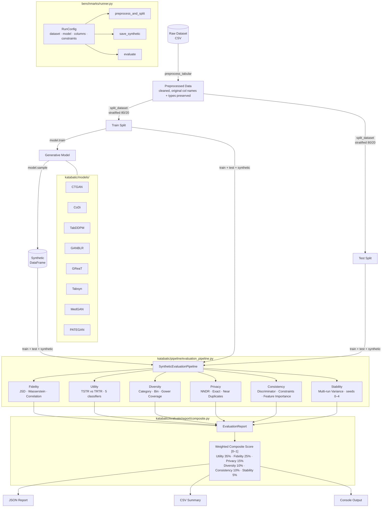
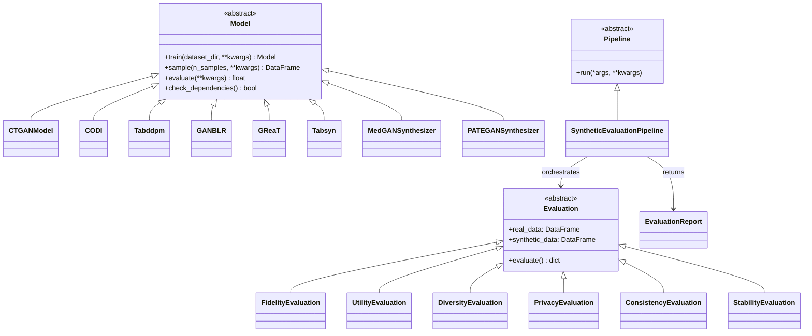
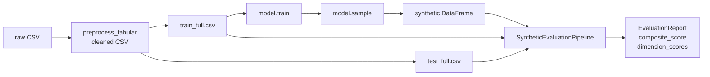

# Katabatic — Project Architecture

## Overview

Katabatic is a library of tabular data generative models with a 6-dimension evaluation pipeline. Every model follows the same abstract interface, and any generated synthetic dataset can be scored through the same pipeline regardless of which model produced it.

---

## Full Architecture



---

## Abstract Base Classes



---

## Data Flow



---

## Directory Structure

```
katabatic/
├── models/
│   ├── base_model.py          # Abstract Model base class
│   ├── registry.py            # Dynamic model loader
│   ├── ctgan/                 # CTGAN implementation
│   ├── codi/                  # CoDi implementation
│   ├── tabddpm/               # TabDDPM implementation
│   ├── ganblr/                # GANBLR implementation
│   ├── great/                 # GReaT implementation
│   ├── tabsyn/                # Tabsyn implementation
│   ├── medgan/                # MedGAN implementation
│   └── pategan/               # PATEGAN implementation
│
├── evaluate/
│   ├── base_evaluation.py     # Abstract Evaluation base class
│   ├── fidelity/              # JSD + Wasserstein + Correlation
│   ├── utility/               # TSTR vs TRTR across 5 classifiers
│   ├── diversity/             # Category + Bin + Gower coverage
│   ├── privacy/               # NNDR + duplicate detection
│   ├── consistency/           # Discriminator + constraints + feature importance
│   ├── stability/             # Multi-run variance
│   └── report/                # EvaluationReport + composite scoring
│
├── pipeline/
│   ├── base_pipeline.py       # Abstract Pipeline base class
│   └── evaluation_pipeline.py # SyntheticEvaluationPipeline (main)
│
└── utils/
    ├── column_types.py        # Categorical/continuous auto-detection
    ├── split_dataset.py       # Stratified train/test split
    └── preprocess.py          # preprocess_tabular + data cleaning

benchmarks/
├── runner.py                  # RunConfig + shared pipeline helpers
└── examples/                  # reference run scripts — copy and adapt for your model
    ├── run_ctgan_adult.py
    ├── run_codi_adult.py
    ├── run_tabddpm_adult.py
    └── run_ctgan_bank_marketing.py
datasets/
├── adult.csv
└── bank_marketing.csv
```
