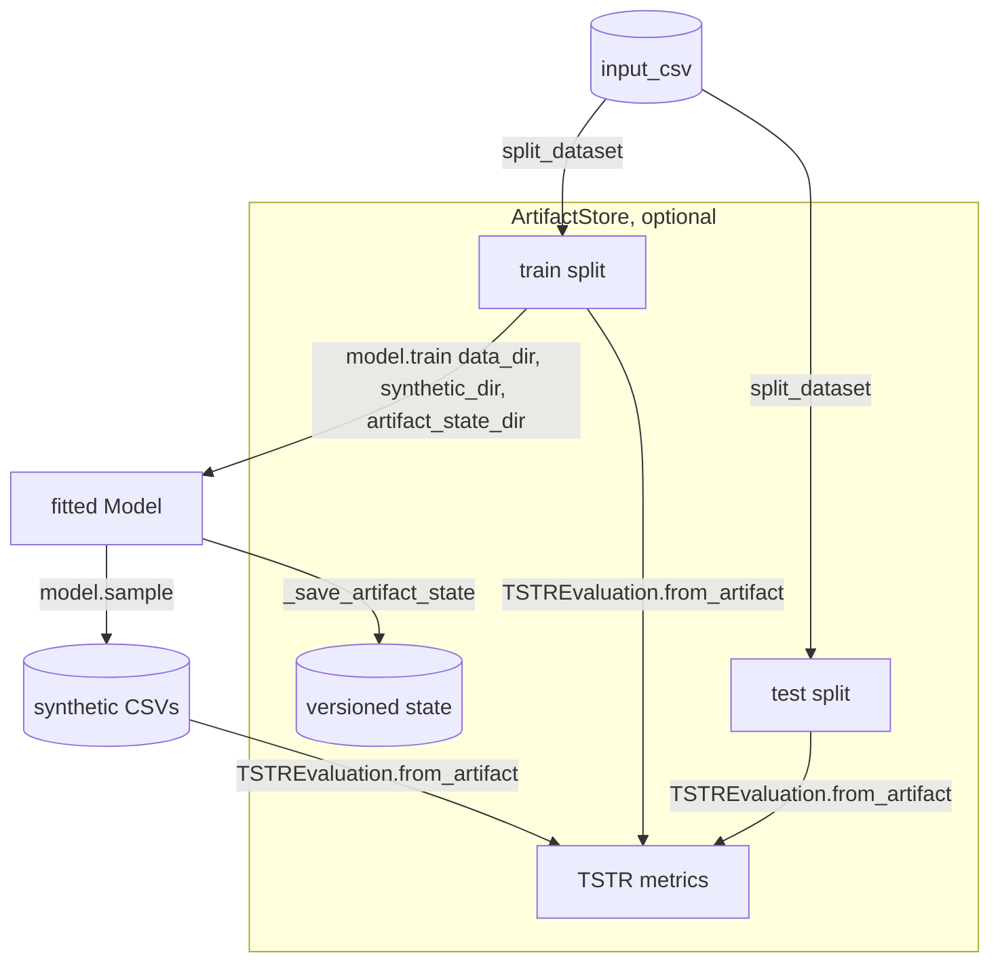
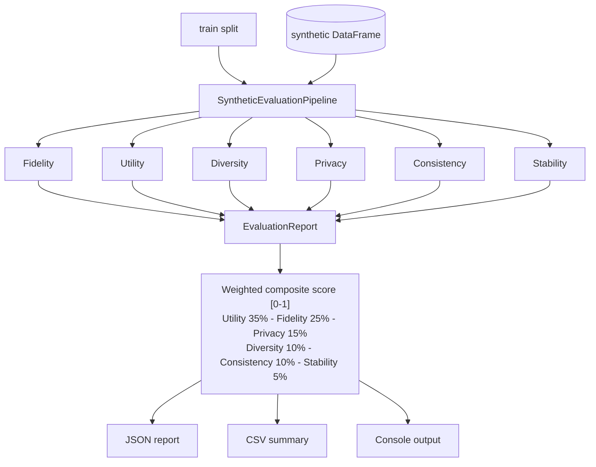
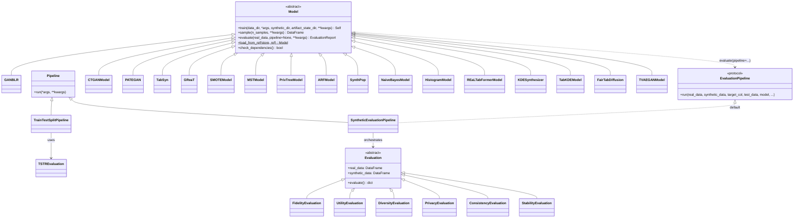

# Katabatic — Project Architecture

## Overview

Katabatic is a library of tabular data generative models sharing one abstract `Model` interface:
each model implements `train` and `sample`, and inherits a shared `evaluate()` (see
[Scoring a model](#scoring-a-model)). Two separate pipelines can run a model end to end:

- **`TrainTestSplitPipeline`** (`katabatic/pipeline/train_test_split/`) — the primary, tested
  path. Splits data, trains a model, scores it with **TSTR** (`katabatic/evaluate/tstr/`), and
  optionally versions everything (dataset, model state, evaluation) under an `ArtifactStore`
  (`katabatic/artifacts/`). Every supported model's integration test exercises this path.
- **`SyntheticEvaluationPipeline`** (`katabatic/pipeline/evaluation_pipeline.py`) — a richer,
  in-memory scorer across 6 dimensions (fidelity, utility, diversity, privacy, consistency,
  stability), producing one weighted composite score. Used by `benchmarks/runner.py`, and the
  default behind `Model.evaluate()`.

**These two are not interchangeable by default.** `TrainTestSplitPipeline`'s evaluation slot
expects a directory/artifact-store-based class with a `from_artifact()` classmethod (see
`TSTREvaluation`); `SyntheticEvaluationPipeline`'s dimensions expect the `Evaluation` ABC's
DataFrame-based `__init__(real_data, synthetic_data)`. A class can support both by implementing
`from_artifact()` as a thin adapter that reads the pipeline's CSVs into DataFrames and delegates
to its own DataFrame-based logic — `FidelityEvaluation` does exactly this (see
`katabatic/evaluate/fidelity/evaluation.py`), verified by
`tests/test_train_test_split_pipeline.py::test_artifact_fidelity_evaluation_smoke`. `TSTREvaluation`
itself takes the inverse approach (directory-based by default, no DataFrame mode). See
`CONTRIBUTING.md`'s "Adding New Evaluations" section before writing a new one.

---

## `TrainTestSplitPipeline` flow



The supported models (`supported: True` in `ModelRegistry`, `katabatic/models/registry.py`) are
`ganblr`, `ctgan`, `pategan`, `tabsyn`, `great`, `smote`, `mst`, `privtree`, `arf`, `synthpop`,
`naivebayes`, `histogram`, `realtabformer`, `kde`, `tabkde`, `fairtabdiffusion` and `tvaegan`. Experimental models
live under `katabatic/experimental/models/`, outside the semantic-versioning guarantee; see
`docs/EXPERIMENTAL_MODELS.md`.

## `SyntheticEvaluationPipeline` flow



---

## Abstract base classes



`Pipeline` (`katabatic/pipeline/base_pipeline.py`) is a plain class, not `abc.ABC` — `run()` just
raises `NotImplementedError` if not overridden. `TSTREvaluation` doesn't subclass `Evaluation`
(see the two-convention note above).

### Scoring a model

`Model.evaluate(real_data, ...)` is concrete on the base class, and models don't override it.
It checks the model is fitted, samples `len(real_data)` rows (unless `synthetic_data=` is
given), aligns the synthetic columns to `real_data` (raising if any are missing), and hands
everything, including the model itself, to an evaluation pipeline's `run()`:

- **Default:** `SyntheticEvaluationPipeline` on all six dimensions, returning an
  `EvaluationReport`. `dimensions=`, `categorical_cols=`, `continuous_cols=` and extra keyword
  arguments (e.g. `weights=`) configure it.
- **Custom:** `pipeline=` takes any object matching the `EvaluationPipeline` protocol in
  `base_model.py`, i.e. a `run()` accepting the keyword arguments above. Its return value is
  passed straight back. Options that only configure the default are rejected alongside
  `pipeline=` rather than silently ignored.

Model-specific diagnostics live under their own names (`evaluate_tstr()` on
GANBLR and PATE-GAN, `evaluate_ks()` on ARF, `evaluate_loss()` on TabSyn, TVAE-GAN and TabDDPM).

---

## Directory structure

```text
katabatic/
├── models/
│   ├── base_model.py       # Model ABC (train/sample), shared evaluate(), artifact-state hooks
│   ├── registry.py         # ModelRegistry — declarative model lookup + install extras
│   └── <model_name>/       # one dir per supported model
│
├── experimental/
│   └── models/<model_name>/  # experimental models; no API stability guarantee
│
├── evaluate/
│   ├── base_evaluation.py  # Evaluation ABC (DataFrame-based; used by SyntheticEvaluationPipeline)
│   ├── tstr/                # TSTREvaluation (directory/artifact-store-based; used by TrainTestSplitPipeline)
│   ├── fidelity/, utility/, diversity/, privacy/, consistency/, stability/  # the 6 dimensions
│   └── report/              # EvaluationReport + composite scoring
│
├── pipeline/
│   ├── base_pipeline.py
│   ├── train_test_split/    # TrainTestSplitPipeline (primary, tested path)
│   └── evaluation_pipeline.py  # SyntheticEvaluationPipeline
│
├── artifacts/                # ArtifactStore: versioned datasets/models/evaluations
│   ├── base.py, local.py, refs.py, ids.py, dataset_split.py
│   ├── remote.py             # FsspecArtifactStore: S3/GCS/Azure via a local cache + sync()/pull()
│
├── datasets/                  # shipped example-dataset catalogue (adult/car/magic/nursery/shuttle
│   │                           # — see datasets/README.md for the documented set)
│   ├── README.md, registry.py, compatibility.py, profile.py, *.csv
│
└── utils/
    ├── column_types.py, split_dataset.py, preprocess.py, train_test_consistency.py

benchmarks/
├── runner.py                  # RunConfig + SyntheticEvaluationPipeline helpers
└── examples/                  # per-model run scripts

examples/                      # quickstart, evaluation and remote-store notebooks (run in CI)
```
