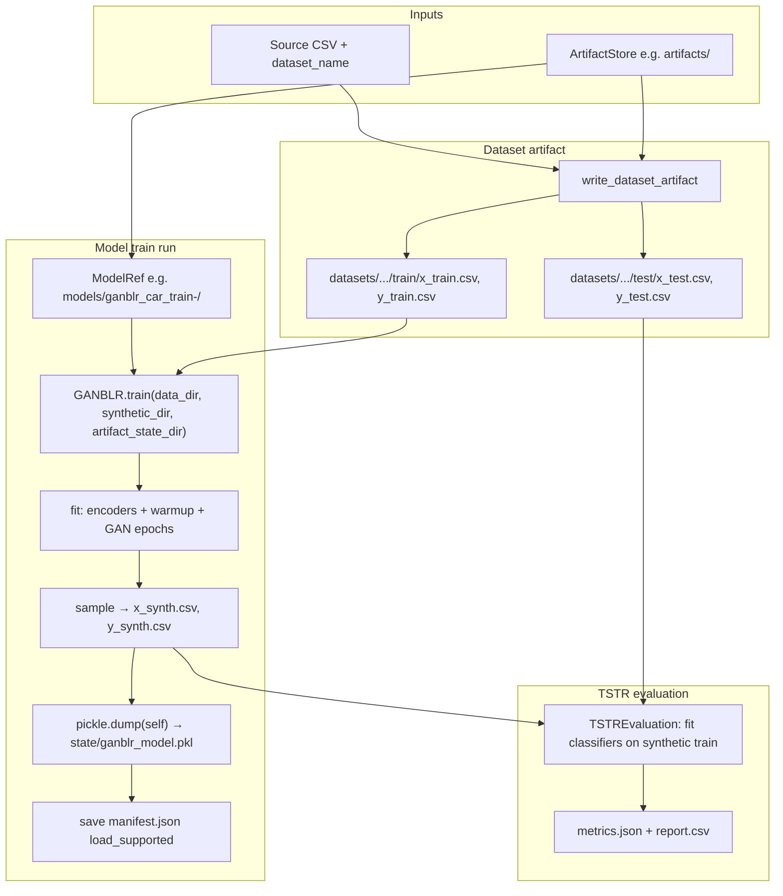

# GANBLR in Katabatic: training, saved state, and reuse

This document sketches how **GANBLR** fits into the Katabatic **artifact pipeline**: split data, train the generative model, persist **pickled state**, write **synthetic CSVs**, run **TSTR** evaluation, and optionally **reload** the fitted model from disk.

## What GANBLR does (conceptually)

1. **Encode** discrete tabular features and the label with sklearn encoders (`OrdinalEncoder`, `LabelEncoder`).
2. **Warmup**: build internal structure (`DataUtils`) and run a short generator warmup.
3. **Adversarial loop** (many epochs): train a fresh discriminator on real vs synthetic feature rows, update the generator with an ELR-style loss, and resample synthetic rows from the learned distribution (via `pgmpy` / structural sampling in `_sample`).
4. After `fit`, **`sample()`** produces synthetic tables in the **original** column space (inverse transform), including the label column.

Training I/O for the bundled pipeline is implemented in `GANBLR.train`: it reads `x_train.csv` / `y_train.csv` from a directory, fits the model, writes `x_synth.csv` / `y_synth.csv`, and—when `artifact_state_dir` is set—pickles the entire fitted `GANBLR` instance.

## Artifact-mode flow (recommended)

`TrainTestSplitPipeline` with `artifact_store`, `dataset_name`, and `input_csv`:

1. **`write_dataset_artifact`** — splits the source CSV under `artifacts/datasets/<dataset>/<split-id>/` (`train/`, `test/`).
2. **`ModelRef`** — assigns a run id and paths like `artifacts/models/ganblr_car_<train-id>/`.
3. **`GANBLR.train`** — receives the **absolute train directory** as its first argument, `synthetic_dir` pointing at the model’s `synthetic/` folder, and `artifact_state_dir` pointing at `state/` (set automatically when the model declares `ARTIFACT_STATE_FILES`).
4. **`_save_artifact_state`** — writes `state/ganblr_model.pkl` (full model pickle, including encoders and internal state).
5. **`manifest.json`** — records metadata; `load_supported` is true when expected state files exist.
6. **`TSTREvaluation.from_artifact`** — trains several sklearn (and optional XGBoost) classifiers on **synthetic** rows and scores on **held-out real** test CSVs; results go under `artifacts/evaluations/<model>_<dataset>/` (for example `ganblr_car/`), with per-run manifest, metrics JSON, and CSV report.

TSTR in this path uses the **saved CSVs**, not the pickle. The pickle is for **reloading the generative model** (e.g. more `sample()` calls, in-notebook exploration, or custom downstream code).

## Mermaid: end-to-end artifact run



## Mermaid: reloading saved state and generating again

After training, any code with access to the same `ArtifactStore` and a `ModelRef` (from `pipeline` return value or by reading `manifest.json` and constructing `ModelRef.from_manifest_dict`) can restore the full object:

```mermaid
sequenceDiagram
  participant User as Caller
  participant Store as LocalArtifactStore
  participant Ref as ModelRef
  participant G as GANBLR

  User->>Store: open_path(ref.state_relpath / ganblr_model.pkl)
  User->>G: GANBLR.load_from_ref(store, ref)
  G->>Store: read pickle bytes
  Store-->>G: bytes
  G-->>User: fitted GANBLR instance
  User->>G: sample(n) or evaluate(x, y)
  Note over G,User: Encoders and _d are inside the pickle; no retrain
```

`load_from_ref` also accepts a legacy filename `ganblr_model.joblib` if present.

## Legacy directory layout (optional)

If you call the pipeline with `input_csv` and `output_dir` only (no artifact store), the same ideas apply: splits go under `output_dir`, synthetic data under `synthetic/<dataset>/ganblr/`, and state under `output_dir/_katabatic_model_state/` when the model supports artifact state files.

## Code pointers

| Piece | Location |
|--------|-----------|
| Pickle save / load | `katabatic/models/ganblr/models.py` — `_save_artifact_state`, `load_from_ref` |
| Pipeline wiring | `katabatic/pipeline/train_test_split/pipeline.py` — `_run_artifact`, `artifact_state_dir` |
| Ref paths | `katabatic/artifacts/refs.py` — `ModelRef`, `DatasetRef`, `EvaluationRef` |
| TSTR | `katabatic/evaluate/tstr/evaluation.py` — `from_artifact`, `load_data` |
