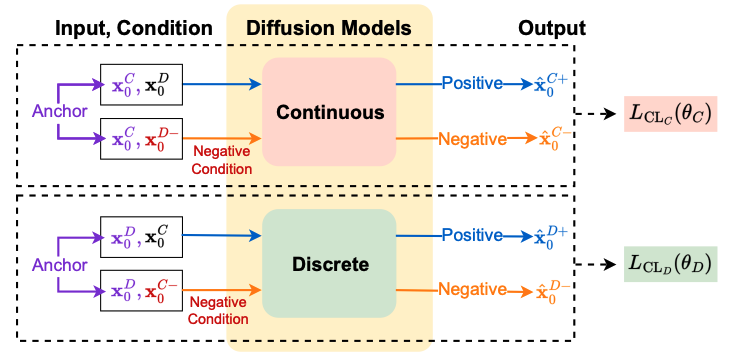

# CoDi: Co-evolving Contrastive Diffusion Models

CoDi (Co-evolving Contrastive Diffusion) is a state-of-the-art generative model for mixed-type tabular data synthesis.

## Overview

CoDi, a synthetic tabular data generator that allows for rows that mix continuous and categorical columns, motivated by the observation that prior methods which one-hot all categoricals into a single continuous model tend to break the correlations between numeric and discrete fields. Its core idea is to run two diffusion models in parallel a Gaussian DDPM for the continuous columns and a multinomial diffusion for the categorical columns. The two models are co-evolved: at every noising and denoising step, each model reads the other's current state as a condition, so the continuous denoiser sees the noisy categoricals and vice versa, which keeps cross-type correlations intact. CoDi adds a contrastive loss that pairs each real row with a positive prediction (conditioned on its true counterpart) and a negative one (conditioned on a randomly shuffled counterpart from another row), training each model to stay close to the matching condition and far from a mismatched one. At sampling time, both models run their reverse processes simultaneously, exchanging conditions step by step, and produce a synthetic row whose continuous and categorical halves were generated together rather than stitched.





## Paper

**CoDi: Co-evolving Contrastive Diffusion Models for Mixed-type Tabular Synthesis**
Lee et al., ICML 2023
[arXiv:2304.12654](https://arxiv.org/abs/2304.12654)

## Implementation Details

**Repository**: Adapted from https://github.com/ChaejeongLee/CoDi

## Installation

```bash
poetry install --extras codi
```

## Usage

```python
from katabatic.models.codi import CODI
from katabatic.pipeline.train_test_split.pipeline import TrainTestSplitPipeline

pipeline = TrainTestSplitPipeline(model=CODI)
pipeline.run(
    input_csv='data/my_dataset.csv',
    output_dir='sample_data/my_dataset',
    synthetic_dir='synthetic/my_dataset/codi',
    real_test_dir='sample_data/my_dataset'
)
```

See `examples/codi.ipynb` for more examples.

## Key Features

- 🎯 Handles mixed-type tabular data (continuous + categorical)
- 🚀 State-of-the-art synthetic data quality
- 🔄 Preserves complex feature dependencies
- 📊 Excellent utility for downstream ML tasks


## References

**CoDi: Co-evolving Contrastive Diffusion Models for Mixed-type Tabular Synthesis**
Chaejeong Lee, Jayoung Kim, Noseong Park
*Proceedings of the 40th International Conference on Machine Learning (ICML 2023), PMLR 202:18940–18956*
Paper: <https://proceedings.mlr.press/v202/lee23i.html>
Preprint: <https://arxiv.org/abs/2304.12654>
Code: <https://github.com/ChaejeongLee/CoDi>

## Generative AI Acknowledgement

**ChatGPT (OpenAI)** was used to assist with interpreting and structuring the CoDI algorithm based on the **original research paper and official repository**.

All generated content was **manually verified, modified, and extended**, including debugging, architectural changes for tabular data, and full experimental integration. The final implementation reflects the author’s independent work.
